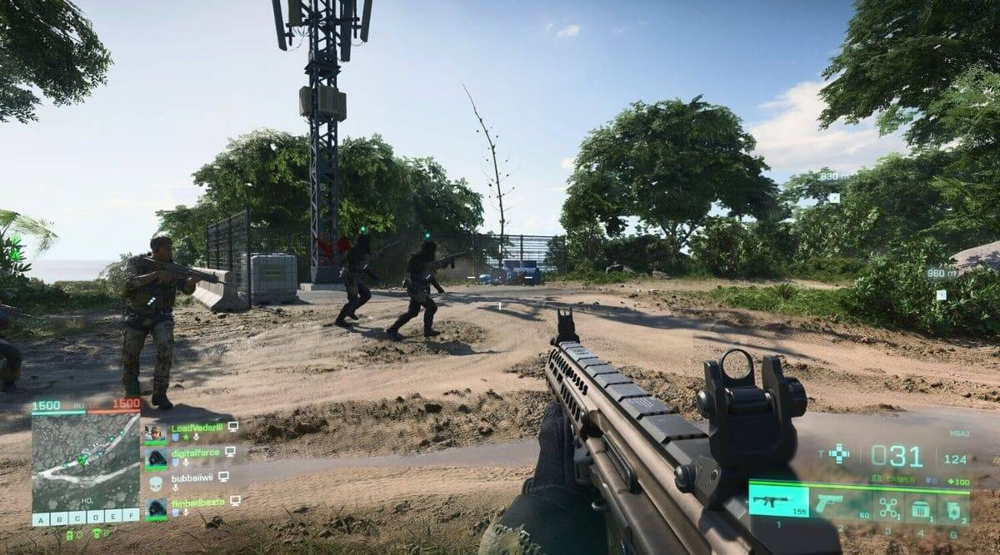

# Welcome to my video games documentation 
Video games are the current rend and people of all ages are behind the various kinds of video games available today.
A video game is an electronic game which involves a human interaction with a user interface, which would generate a visual feedback onto a video device.

Game categories
----

video games can be divided into multiple categories depending on the mecaniques, the playstyle and the overall goal of the game. 
These are the most famouse categories : 
* ##### FPS 

 
this type of games revolves around the players having some sggggggggggggggorts of weapons they can use to aim at certain targets with the use of their mouse.
this genra is genrally offers the best PVP experiences 
        <table>
            <tr>
                <th>Name</th>
                <th>RollNo</th>
            </tr>
            <tr>
                <td>Jason</td>
                <td>28</td>
            </tr>
        </table>
* ##### MOBA 

 
* ##### SIMULATION

 